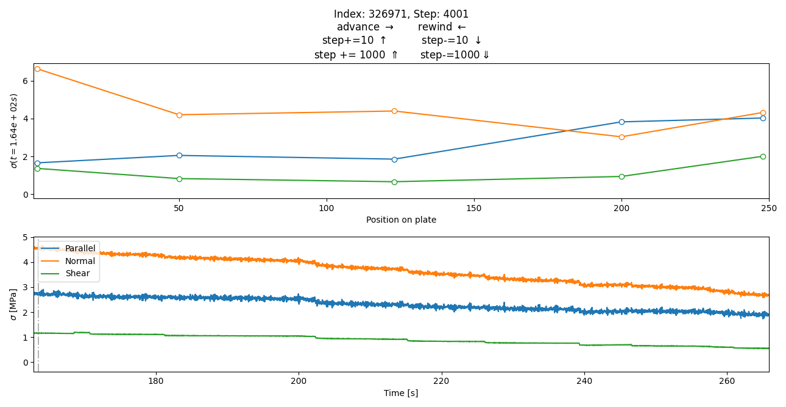

# FricFrac

This module is used for a small semester projet @EPFL. It is free of use, at your own risk.

## Experiment setup

The code is intended for the following setup:
- Two PMMA plates are sheared against each other
- Strain gauges are placed along the plate, close to the sheared frontier
- The strains are recorded in files readable with [pandas](https://pandas.pydata.org/)/[polars](https://pola.rs/) with one column for time and triplets of strain gauge columns. In short, the files should ressemble the following:

| Relative time | Ch01      | Ch02 | Ch03 | … | Ch18      | Ch19 | Ch20     |
|---------------|-----------|------|------|---|-----------|------|----------|
| -0.005        | -0.177943 | -2.0 | -2.0 | … | -0.367605 | -2.0 | 0.017335 |
| -0.004998     | -0.263445 | -2.0 | -2.0 | … | -0.43433  | -2.0 | 0.013566 |
| …             | …         | …    | …    | … | …         | …    | …        |
| 0.0049975     | -0.20223  | -2.0 | -2.0 | … | -0.367605 | -2.0 | 0.000502 |
| 0.0049995     | -0.3772   | -2.0 | -2.0 | … | -0.354459 | -2.0 | -0.006029|

## Implemented functions

> `read()` (for reading the `csv` files)
> `lowfilter()` for reducing noise
> `straindf()` for computing the strains from the signal
> `stressdf()` for computing the stresses from the strains
> `select_files()` is a simple GUI tool for choosing the files to work with

In order to pass from the rosette signals to strains, an amplification factor and a rotation matrix (3x3) are used.

1. elongation $\gets$ amplification factor * signal
2. strains $\gets$ rotation matrix @ elongation

The `rotation_matrix` function is implemented for any orientations but it is simply used for the standard (45, 90, 135) holy trinity of angles for the measure of shear. The broadcasting of the matrix to all measures uses `numpy.einsum`.

# Implemented plots

### `BigBrother` looks at everything

### `MeanBrother` looks at the averaged values over all rosettes

### `PlatePlot` looks at the averaged values over all rosettes

Here is a gif to simulate an interactive plot

## The `BogPolarBrother`

Is a duplicate of the `BigBrother` script with polars instead of pandas.